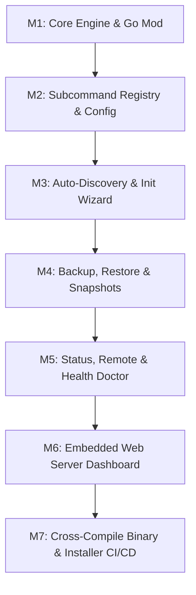

# Plan Migrasi Komprehensif: Gaet Python ke Go (Golang) V2.0

Dokumen ini berisi rencana strategis, arsitektur, peta modul, dan tahap eksekusi komprehensif untuk memigrasikan codebase **Gaet** dari **Python 3.8+** ke **Go (Golang)** pada branch `feat/golang-migration`.

---

## 1. Eksekutif Ringkasan & Tujuan Migrasi

### Mengapa Migrasi ke Go?
1. **Single Standalone Binary File (`gaet` / `gaet.exe`)**:
   - Menghasilkan 1 file executable mandiri berukuran ~8-12 MB.
   - **Zero External Runtime Dependency**: Pengguna & server target tidak perlu menginstall Python 3.8+, pip, atau virtual environment.
2. **Performa Startup Instan (< 5ms)**:
   - Respon CLI secepat perintah bawaan OS (`ls`, `cat`, `git`).
3. **Web Dashboard Terintegrasi Dalam Binary (`//go:embed`)**:
   - Aset Web UI (HTML, CSS, JS, logo) dimasukkan penuh ke dalam binary tunggal `gaet`. Tidak ada folder `dashboard/` terpisah di komputer user.
4. **Concurrency Native (Goroutines & Channels)**:
   - Pemrosesan pengecekan & backup multi-database paralel secara *native* dengan RAM < 15MB.
5. **Cross-Compilation Bawaan**:
   - Kompilasi untuk Linux (amd64/arm64), macOS (Apple Silicon/Intel), dan Windows (amd64) dapat dilakukan dari 1 mesin dengan 1 baris perintah.

---

## 2. Pemetaan Struktur Kode: Python vs. Go

Struktur modul Python yang terisolasi di `src/gaet/` akan dipetakan ke dalam paket Go standar di bawah `pkg/`:

```text
gaet/ (Go Repository)
├── go.mod                       # Modul Go (module github.com/ghanirahmans/gaet)
├── main.go                      # Entry point shim dispatcher (menggantikan gaet.py)
├── cmd/
│   └── gaet/
│       └── root.go              # Dispatcher subcommand CLI & Signal Handler
├── pkg/
│   ├── core/                    # XDG paths, ASCII tags, .env parser, exec runner (dari core.py)
│   ├── registry/                # Subcommand router & argument parser
│   ├── detect/                  # Auto-discovery socket/TCP PostgreSQL (dari detect.py)
│   ├── init/                    # Interactive setup wizard (dari init.py)
│   ├── config/                  # Handler gaet get / set (dari config.py)
│   ├── backup/                  # Handler gaet push / fetch (dari backup.py)
│   ├── restore/                 # Snapshot restore + safety guards (dari restore.py)
│   ├── snapshots/               # Snapshot manager (dari snapshots.py)
│   ├── remote/                  # Cloud remote config (dari remote.py)
│   ├── status/                  # Health check & doctor (dari status.py)
│   ├── scheduler/               # Systemd/Launchd/TaskScheduler manager (dari scheduler.py)
│   ├── serve/                   # Embedded HTTP Dashboard Server (dari serve.py)
│   ├── log/                     # Execution history viewer (dari log.py)
│   └── update/                  # Self-updater & uninstaller (dari update.py)
├── dashboard/                   # Aset Frontend (HTML/CSS/JS)
│   └── embed.go                 # Struct //go:embed static/* untuk kompilasi binary
├── scripts/                     # Service template files
├── tests/                       # Go Native Test Suite (*_test.go)
├── install.sh                   # One-liner downloader binary untuk Linux/macOS
├── install.ps1                  # One-liner downloader binary untuk Windows
└── migrasi_to_golang.md         # Blueprint dokumen ini
```

---

## 3. Matriks Pemetaan Fungsi Teknis

| Komponen Python (`src/gaet/`) | Komponen Go Target (`pkg/`) | Implementasi Teknis Go |
| :--- | :--- | :--- |
| **`core.py`** (Paths & XDG) | `pkg/core/paths.go` | `os.UserHomeDir()`, `filepath.Join()`, `os.MkdirAll()` |
| **`core.py`** (`status_ok`, `status_fail`) | `pkg/core/output.go` | `fmt.Printf("  [ OK ] %s\n", msg)` (100% Pure ASCII UI) |
| **`core.py`** (`run_cmd`) | `pkg/core/exec.go` | `exec.CommandContext()` dengan timeout & buffer output |
| **`core.py`** (`load_env`, `save_env`) | `pkg/core/env.go` | Custom parser file `.env` (tanpa library luar) |
| **`registry.py`** (`@command`) | `pkg/registry/router.go` | Interface `Command` deklaratif + Go `flag.FlagSet` |
| **`detect.py`** (`detect_local_pg`) | `pkg/detect/pg.go` | `filepath.Glob("/run/postgresql/.s.PGSQL.*")` & socket scanner |
| **`init.py`** (`gaet init`) | `pkg/init/wizard.go` | `bufio.NewScanner(os.Stdin)` & `term.ReadPassword()` |
| **`backup.py`** (`gaet push`) | `pkg/backup/push.go` | Subprocess call `pg_dump` dengan `exec.Command` |
| **`restore.py`** (`gaet restore`) | `pkg/restore/restore.go` | Subprocess call `pg_restore` / `psql` + Konfirmasi `--yes` |
| **`serve.py`** (`gaet serve`) | `pkg/serve/server.go` | Native `net/http.Server` + `//go:embed dashboard/static` |
| **`update.py`** (`gaet update`) | `pkg/update/updater.go` | HTTP GET GitHub Release Binary Asset + self-replacement |

---

## 4. Tahap Eksekusi & Milestones (Phase M1 - M7)



### 📌 Phase M1: Inisialisasi Proyek & Core Package (`pkg/core`)
- [ ] Inisialisasi `go.mod` (Module: `github.com/ghanirahmans/gaet`, Target: Go 1.21+).
- [ ] Porting konstanta XDG (`GAET_APP_DIR`, `GAET_DIR`, `ENV_FILE`, `BACKUP_DIR`).
- [ ] Porting sistem status output ASCII (`status_ok`, `status_fail`, `status_warn`, `status_info`, `status_arrow`).
- [ ] Porting parser file `.env` (Zero dependency).
- [ ] Porting pembungkus subprocess (`exec.Command`) dengan penanganan error dan timeout.
- [ ] Menulis unit test awal di `pkg/core/core_test.go`.

### 📌 Phase M2: Subcommand Router & Config Handler (`pkg/registry`, `pkg/config`)
- [ ] Membuat router subcommand deklaratif menggunakan interface `Command`.
- [ ] Menyiapkan penanganan flag global (`--json`, `--plain`, `--quiet`, `--yes`, `--debug`).
- [ ] Porting perintah `gaet get` dan `gaet set` untuk membaca/menulis `.env`.
- [ ] Menulis unit test untuk router & config parser.

### 📌 Phase M3: Auto-Discovery & Interactive Setup Wizard (`pkg/detect`, `pkg/init`)
- [ ] Porting deteksi socket Unix PostgreSQL (`/tmp`, `/var/run/postgresql`, `/run/postgresql`).
- [ ] Porting deteksi port TCP PostgreSQL & daftarkan instance aktif.
- [ ] Porting wizard interaktif `gaet init` untuk panduan prompt terminal.
- [ ] Menambahkan dukungan mode non-interaktif (CI/CD).

### 📌 Phase M4: Backup, Restore & Snapshot Management (`pkg/backup`, `pkg/restore`, `pkg/snapshots`)
- [ ] Porting `gaet push` (pembuatan dump otomatis via `pg_dump` dengan kompresi kustom).
- [ ] Porting `gaet fetch` (penarikan snapshot dari cloud remote).
- [ ] Porting `gaet restore` dengan proteksi konfirmasi TTY / flag `--yes`.
- [ ] Porting `gaet snapshots` (pengelolaan retensi file dump & kalkulasi kuota).

### 📌 Phase M5: Health, Sync & Remote Management (`pkg/status`, `pkg/remote`)
- [ ] Porting `gaet status` & `gaet check` (pemeriksaan konektivitas database lokal & cloud).
- [ ] Porting `gaet doctor` (diagnostik sistem, permission, & perkakas `pg_dump`).
- [ ] Porting `gaet remote` (konfigurasi URL database cloud remote).

### 📌 Phase M6: Embedded Web Server Dashboard (`pkg/serve`)
- [ ] Membungkus seluruh file `dashboard/static/` menggunakan `//go:embed`.
- [ ] Porting server HTTP ringan menggunakan `net/http` di `pkg/serve`.
- [ ] Menyiapkan API endpoint `/api/status`, `/api/snapshots`, dan `/api/logs`.

### 📌 Phase M7: Cross-Compilation, Installer & CI/CD Pipeline
- [ ] Membuat skrip kompilasi `build.sh` / `Makefile` untuk target:
  - `gaet-linux-amd64`
  - `gaet-linux-arm64`
  - `gaet-darwin-amd64` (Mac Intel)
  - `gaet-darwin-arm64` (Mac Apple Silicon M1/M2/M3)
  - `gaet-windows-amd64.exe`
- [ ] Meng-update `install.sh` dan `install.ps1` agar mendownload binary rilisan langsung dari GitHub Releases.
- [ ] Membuat workflow GitHub Actions `.github/workflows/release.yml` untuk auto-build binary.

---

## 5. Aturan Arsitektur & Kuisin Go (Non-Negotiable Constraints)

1. **Zero External PyPI/Go Module Overhead**:
   - Mengutamakan **Go Standard Library** (`net/http`, `os/exec`, `path/filepath`, `crypto`, `encoding/json`, `flag`).
   - Mencegah *bloatware* dependency agar ukuran binary tetap berada di kisaran 8–12 MB.
2. **Strict ASCII Output Consistency**:
   - Seluruh cetakan CLI wajib menggunakan format tag ASCII yang identik dengan versi Python:
     - `  [ OK ]  Message`
     - `  [FAIL]  Message`
     - `  [WARN]  Message`
     - `  [INFO]  Message`
     - `  [NOTE]  Message`
3. **Fail-Safe Exception Handling**:
   - Semua fungsi internal melempar `error` bertipe (`GaetError`).
   - Penanganan `os.Exit()` hanya diperbolehkan di layer terluar `cmd/gaet/root.go`.
4. **Coverage & Test Parity**:
   - Setiap paket wajib memiliki file `*_test.go` dengan target kelulusan 100% di runner CI (`go test -v ./...`).

---

## 6. Status Branch & Proteksi Kode Python

* **Branch LTS/Stable**: `lts/v1.0` (Menyimpan versi Python 3.8+ stabil 48/48 test pass).
* **Branch Checkpoint**: `main` (Versi Python 3.8+ stabil).
* **Branch Pengembangan Migrasi Go**: `feat/golang-migration` (Branch aktif saat ini).

*Dokumen ini merupakan pedoman resmi proyek migrasi Gaet V2.0 ke Go (Golang).*
